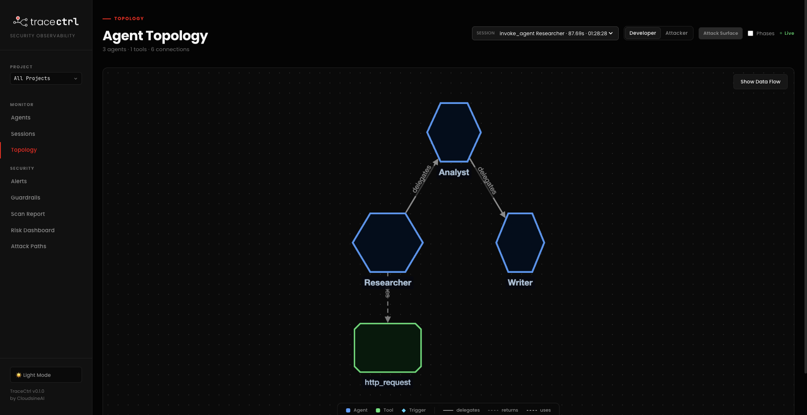

# Strands Agents Example: Research Assistant Workflow

This example demonstrates a three-agent agentic workflow using [Strands Agents](https://github.com/strands-agents/docs), monitored with [TraceCtrl](https://tracectrl.io).

A **Researcher**, **Analyst**, and **Writer** agent work in sequence to research a topic or fact-check a claim, with every agent call and tool use visible in the TraceCtrl UI.

## Prerequisites

- Python 3.10+
- AWS account with [Amazon Bedrock model access](https://docs.aws.amazon.com/bedrock/latest/userguide/model-access.html) enabled
- TraceCtrl running locally (OTLP endpoint on port 4317)
- TraceCtrl SDK cloned locally

## Setup

### 1. Clone the repository

```bash
git clone https://github.com/tracectrl/tracectrl-bootcamp-examples.git
cd tracectrl-bootcamp-examples
```

### 2. Configure environment variables

```bash
cp .env.example .env
```

Edit `.env` and fill in your credentials:

```env
AWS_ACCESS_KEY_ID=your_access_key
AWS_SECRET_ACCESS_KEY=your_secret_key
AWS_DEFAULT_REGION=us-east-1

TRACECTRL_ENDPOINT=http://localhost:4317
TRACECTRL_SERVICE_NAME=agents-workflow
TRACECTRL_ENVIRONMENT=demo
```

### 3. Set the TraceCtrl SDK path

Edit `run_agents_workflow.sh` and replace `<TRACECTRL_SDK>` with the path to your local TraceCtrl SDK:

```bash
TRACECTRL_SDK="<PATH_TO_TRACECTRL_SDK>"
```

### 4. Make the script executable

```bash
chmod +x run_agents_workflow.sh
```

## Running the Example

### 1. Ensure TraceCtrl is running

Make sure your TraceCtrl instance is up and accepting traces on port 4317 before proceeding.

### 2. Execute the script

```bash
bash run_agents_workflow.sh
```

The script will automatically create a virtual environment and install all required dependencies on first run.

### 3. Enter your question

At the prompt, enter a research question or a claim to fact-check:

```
> What are quantum computers?
> Lemon cures cancer
> Tuesday comes before Monday in the week
```

Type `exit` to quit.

### 4. View the Topology

Open the TraceCtrl UI and navigate to the **Topology** view to see the full agent workflow — each agent, tool call, and LLM invocation traced in real time.


