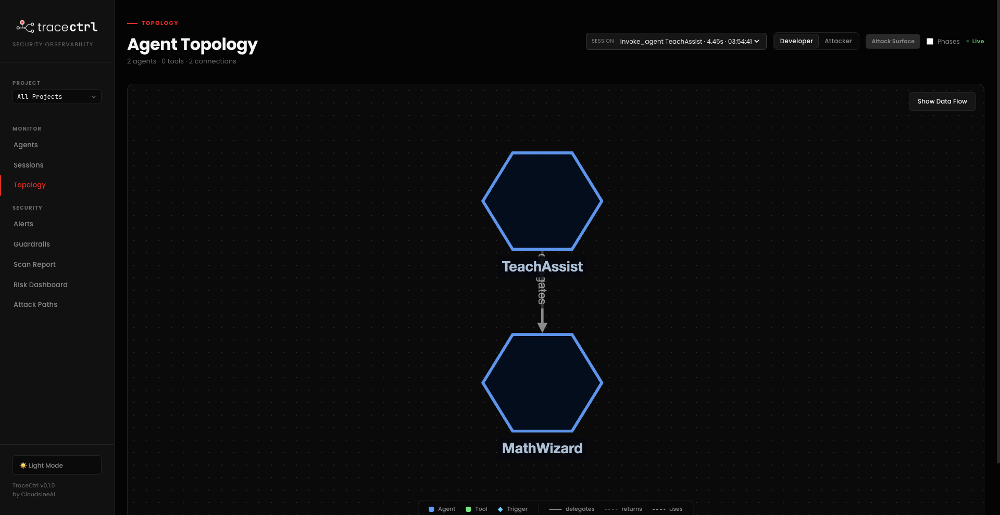
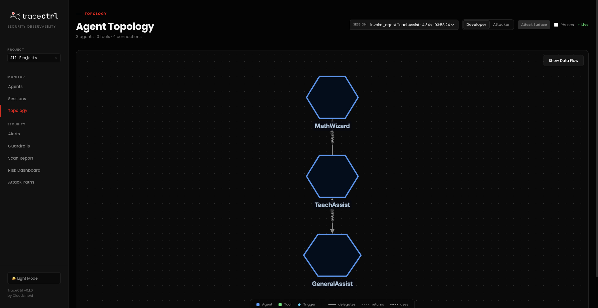
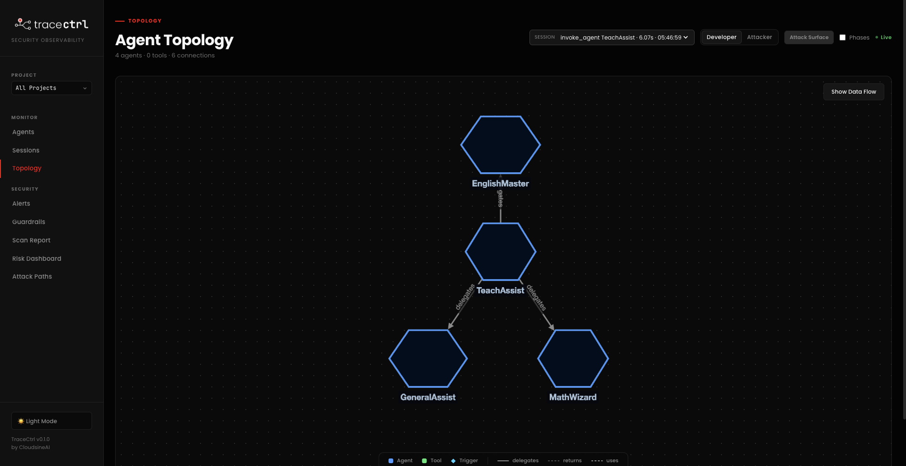
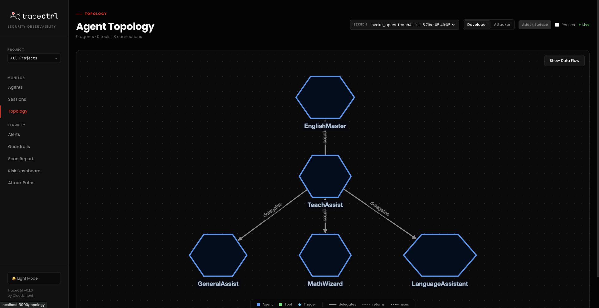

# Strands Agents Example: Teacher's Assistant Workflow

This example demonstrates a multi-agent orchestration workflow using [Strands Agents](https://github.com/strands-agents/docs), monitored with [TraceCtrl](https://tracectrl.io).

A **TeachAssist** orchestrator routes student queries to the most appropriate specialist agent — **MathWizard**, **EnglishMaster**, **LanguageAssistant** or **GeneralAssist** — with every routing decision and agent call visible in the TraceCtrl UI.

## Prerequisites

- Python 3.10+
- [Google AI Studio API key](https://aistudio.google.com/apikey)
- TraceCtrl running locally (OTLP endpoint on port 4317)
- TraceCtrl SDK cloned locally

## Setup

### 1. Clone the repository

```bash
git clone https://github.com/tracectrl/tracectrl-bootcamp-examples.git
cd tracectrl-bootcamp-examples/teacher_assistants_workflow_example
```

### 2. Configure environment variables

```bash
cp .env.example .env
```

Edit `.env` and fill in your credentials:

```env
GOOGLE_API_KEY=your_google_ai_studio_key
GOOGLE_MODEL_ID=gemini-3.1-flash-lite

TRACECTRL_ENDPOINT=http://localhost:4317
TRACECTRL_SERVICE_NAME=teachers-assistant
TRACECTRL_ENVIRONMENT=demo
```

Replace `your_google_ai_studio_key` with your API key from [Google AI Studio](https://aistudio.google.com/apikey) and set `GOOGLE_MODEL_ID` to the model you want to use (e.g. `gemini-3.1-flash-lite`, `gemini-2.0-flash`).

### 3. Set the TraceCtrl SDK path

Edit `run_agents_workflow.sh` and replace `<TRACECTRL_SDK>` with the path to your local TraceCtrl SDK:

```bash
TRACECTRL_SDK="<PATH_TO_TRACECTRL_SDK>"
```

### 4. Make the script executable

```bash
chmod +x run_agents_workflow.sh
```

## Running the Example

### 1. Ensure TraceCtrl is running

Make sure your TraceCtrl instance is up and accepting traces on port 4317 before proceeding.

### 2. Execute the script

```bash
bash run_agents_workflow.sh
```

The script will automatically create a virtual environment and install all required dependencies on first run.

### 3. Enter your question

At the prompt, ask any subject-area question and TeachAssist will route it to the right specialist.

**Prompt 1:** `What is 1 + 1?`

TeachAssist routes this to **MathWizard**.



---

**Prompt 2:** `Define Apple`

TeachAssist routes this to **GeneralAssist**.



---

**Prompt 3:** `Write me a poem`

TeachAssist routes this to **EnglishMaster**.



---

**Prompt 4:** `Translate hello to French`

TeachAssist routes this to **LanguageAssistant**.



---

Type `exit` to quit.

### 4. View the Topology

Open the TraceCtrl UI and navigate to the **Topology** view to see the full agent workflow — the orchestrator, which specialist was invoked, and every tool call traced in real time.

## Agents

| Agent | File | Specialisation |
|-------|------|---------------|
| TeachAssist | `teachers_assistant.py` | Orchestrator — classifies and routes queries |
| MathWizard | `math_assistant.py` | Arithmetic, algebra, geometry, statistics |
| EnglishMaster | `english_assistant.py` | Writing, grammar, literature, composition |
| LanguageAssistant | `language_assistant.py` | Translation and language learning |
| GeneralAssist | `no_expertise.py` | General knowledge outside specialist domains |
